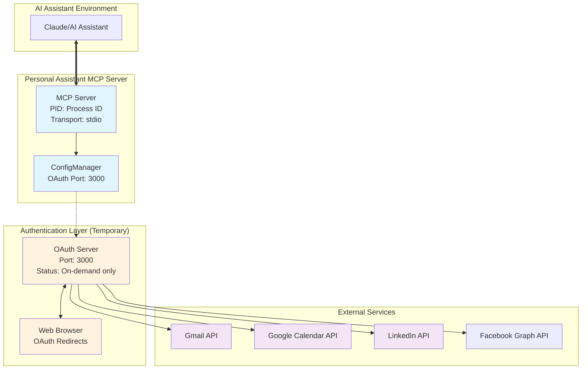
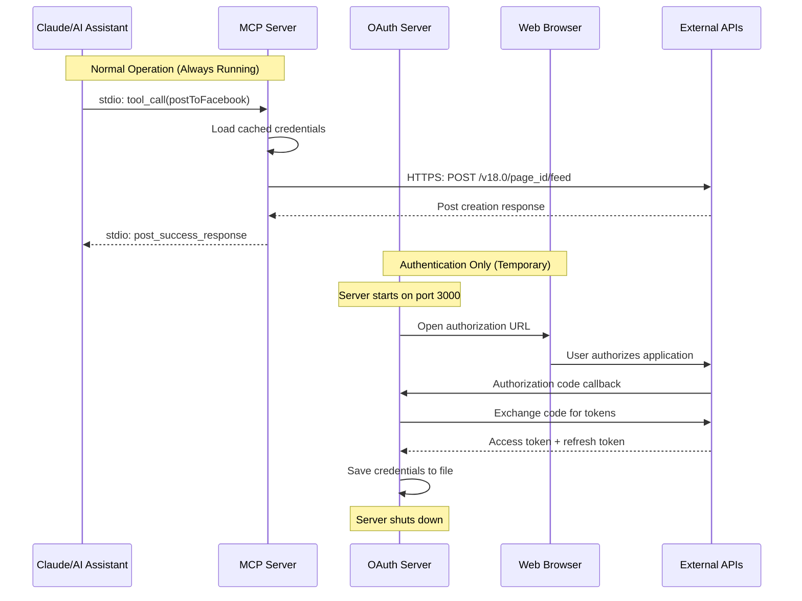

<div align="center">
    <h1 align="center">Personal Assistant MCP Server</h1>
    <p align=center>
        <a href="https://badge.fury.io/js/@softleolabs%2Fpersonal-assistant-mcp"></a>
        <a href="https://github.com/softleo-llc/personal-assistant-mcp/stargazers"></a>
        <a href="https://github.com/softleo-llc/personal-assistant-mcp/forks"></a>
        <a href="https://smithery.ai/server/@softleolabs/personal-assistant-mcp"></a>
        <a href="https://www.npmjs.com/package/@softleolabs/personal-assistant-mcp"></a>
</div>

Transform your AI assistant into a powerful **Personal Productivity Companion** with this comprehensive [Model Context Protocol (MCP)](https://modelcontextprotocol.io/introduction) server. Seamlessly integrates [Gmail](https://developers.google.com/gmail/api), [Google Calendar](https://developers.google.com/calendar/api), [LinkedIn](https://docs.microsoft.com/en-us/linkedin/), and [Facebook Graph API](https://developers.facebook.com/docs/graph-api) to provide your AI with professional-grade capabilities for email management, intelligent scheduling, and **advanced social media automation**.

Perfect for AI assistants that need to help users manage their digital workflows, automate routine tasks, and maintain professional communications across multiple platforms. Whether you're building a personal AI assistant, business automation tool, or productivity-focused chatbot, this server provides the essential tools for real-world productivity tasks.

**🚀 Latest Features**: Enhanced content publishing with **Facebook page management**, automatic sentiment analysis, comprehensive analytics, and production-ready OAuth2 authentication across all platforms.

<p align="center"></p>

## Overview

**Current Status**: 66+ MCP Tools Available

- **Gmail**: 40+ tools covering complete email management, settings, and automation
- **Google Calendar**: 6 tools for comprehensive calendar and event management
- **LinkedIn**: 6+ tools for professional networking and enhanced content publishing
  - ✅ **Profile Management**: Complete profile retrieval with OpenID Connect
  - ✅ **Text Posts**: Rich text posting with hashtags and visibility control
  - ✅ **Image Posts**: Local image upload with automatic LinkedIn asset management
  - ✅ **Authentication**: Automatic port cleanup and robust OAuth2 flow
- **Facebook**: 9 tools for comprehensive page management and social media automation
  - ✅ **Page Management**: Multi-page support with secure token handling
  - ✅ **Content Publishing**: Rich posts, media sharing, and scheduling capabilities
  - ✅ **Analytics & Insights**: Advanced page metrics and performance tracking
  - ✅ **Comment Moderation**: Automated sentiment analysis and engagement tools
- **Project Management**: 4 tools for GitHub repository organization, project backups, task management, and analytics
- **Text Formatting**: 4 tools for Unicode text transformation (Bold Serif, Italic Serif variants)
- **Authentication**: Unified OAuth2 system supporting multiple Google services, LinkedIn, and Facebook

## Architecture

This MCP server uses a **dual-server architecture** that separates the main MCP server from OAuth authentication servers for optimal security and performance.

### System Architecture



### Communication Flow



### Key Benefits

- **🔒 Security**: OAuth servers run only during authentication, minimizing attack surface
- **⚡ Performance**: MCP server uses direct stdio communication with Claude (no HTTP overhead)
- **🚫 No Port Conflicts**: MCP server doesn't compete for HTTP ports
- **🔧 Configurable**: OAuth port can be customized via `--oauth-port` parameter
- **📊 Clear Separation**: Authentication logic is isolated from core MCP functionality

### Port Usage

| Component        | Port                | Purpose                  | Status         |
| ---------------- | ------------------- | ------------------------ | -------------- |
| **MCP Server**   | None (stdio)        | Claude communication     | Always running |
| **OAuth Server** | 3000 (configurable) | Authentication redirects | Temporary only |

## Features

### Gmail Integration

- Complete Gmail API coverage including messages, threads, labels, drafts, and settings
- Support for sending, drafting, and managing emails
- Label management with customizable colors and visibility settings
- Thread operations for conversation management
- Settings management including vacation responder, IMAP/POP, and language settings
- History tracking for mailbox changes

### Google Calendar Integration

- Complete Google Calendar API coverage for events and calendar management
- Create, read, update, and delete calendar events with natural language date parsing
- Support for attendees, locations, descriptions, and recurrence rules
- Multiple calendar support with calendar listing and management
- Time zone awareness and flexible datetime handling

### LinkedIn Integration

**🚀 Production-Ready LinkedIn Integration** with comprehensive posting and profile management:

#### ✅ **Profile Management**

- **Complete Profile Access**: Name, ID, profile picture, and headline retrieval
- **OpenID Connect Support**: Uses standard OAuth2 scopes (`openid`, `profile`) for reliable access
- **Automatic User Detection**: Seamless integration with LinkedIn's userinfo endpoint
- **Profile Picture Support**: Full support for LinkedIn profile image access

#### ✅ **Enhanced Content Publishing**

- **Text-Only Posts**: Rich text posting with hashtag support and visibility control
- **Image Posts**: Upload local images directly from your file system
  - **Multi-Format Support**: JPG, JPEG, PNG, GIF, BMP, WebP
  - **Automatic Upload**: 3-step LinkedIn asset registration and upload process
  - **Alt Text Support**: Accessibility-friendly image descriptions
  - **Local File Integration**: Direct file path input for seamless workflow
- **Visibility Control**: PUBLIC or CONNECTIONS visibility settings
- **Content Formatting**: Full support for hashtags, mentions, and rich formatting

#### ✅ **Technical Excellence**

- **Automatic Port Management**: Intelligent port conflict detection and resolution
- **Robust Authentication**: Enhanced OAuth2 flow with error recovery
- **API Optimization**: Uses both LinkedIn REST API v2 and OpenID Connect for maximum compatibility
- **Production Reliability**: Comprehensive error handling and logging
- **Backward Compatibility**: Maintains support for legacy function calls

#### 📋 **Available Functions**

1. **`getUserProfile()`** - Retrieve complete user profile information
2. **`createTextPost()`** - Publish text-only posts with rich formatting
3. **`createImagePost()`** - Publish posts with local images
4. **`createPost()`** - Legacy function (backward compatible)
5. **`getCompanyInfo()`** - Access company and organization information
6. **`formatProfilePicture()`** - Process and format profile images

#### 🔧 **Usage Examples**

**Text Post:**

```javascript
await createTextPost(linkedin, tokens, {
  content:
    "🚀 Exciting news! Just launched our new LinkedIn integration with #MCP #AI #LinkedIn",
  visibility: "PUBLIC",
});
```

**Image Post:**

```javascript
await createImagePost(linkedin, tokens, {
  content:
    "📊 Check out our latest analytics dashboard! #DataVisualization #Analytics",
  imagePath: "/path/to/your/image.jpg",
  imageAltText: "Analytics dashboard showing performance metrics",
  visibility: "PUBLIC",
});
```

### Facebook Integration

**🎯 Comprehensive Facebook Page Management** with complete posting, analytics, and engagement tools:

#### ✅ **Page Management**

- **Multi-Page Support**: Manage multiple Facebook pages from a single account
- **Page Information**: Access page details, follower count, and basic metrics
- **Access Token Management**: Secure page-level token handling for enhanced permissions

#### ✅ **Content Publishing**

- **Rich Text Posts**: Create engaging posts with full text formatting
- **Media Posts**: Support for image and video content (planned)
- **Link Sharing**: Share external links with automatic preview generation
- **Post Scheduling**: Plan and schedule content for optimal engagement times
- **Hashtag Support**: Automatic hashtag processing and trending topic integration

#### ✅ **Engagement & Analytics**

- **Comment Management**: Read, reply to, and moderate user comments
- **Sentiment Analysis**: Filter and identify negative comments automatically
- **Post Analytics**: Track likes, shares, comments, and reach metrics
- **Page Insights**: Access detailed page performance data
- **Content Moderation**: Advanced filtering and automated moderation tools

#### ✅ **Advanced Features**

- **Bulk Operations**: Delete multiple posts, manage comments in batch
- **Content Filtering**: Smart filtering based on keywords and sentiment
- **Auto-Moderation**: Automated negative comment detection and handling
- **Engagement Tracking**: Monitor post performance and audience interaction

#### 🔧 **Usage Examples**

**Create Post:**

```javascript
await postToFacebook({
  content: "🚀 Exciting update from our team! #Innovation #Technology #Growth",
  pageId: "your-page-id",
});
```

**Get Page Analytics:**

```javascript
const analytics = await getPageAnalytics({
  pageId: "your-page-id",
  startDate: "2024-01-01",
  endDate: "2024-01-31",
});
```

**Comment Moderation:**

```javascript
const negativeComments = await filterNegativeComments({
  postId: "post-id",
  threshold: 0.7,
});
```

### Authentication & Security

- Secure OAuth2 authentication using Google Cloud credentials, LinkedIn OAuth, and Facebook OAuth
- Unified OAuth system supporting Gmail, Google Calendar, LinkedIn APIs, and Facebook Graph API
- Token refresh and credential validation
- **Important**: Authentication setup must be run separately from the MCP server, as MCP clients cannot execute interactive OAuth flows

## Architecture Notes

**Why Authentication is Separate**: MCP servers run in a sandboxed environment where the MCP client controls execution. Interactive OAuth flows (which require opening browsers, user consent, and callback handling) cannot be executed by the MCP client. Therefore:

1. **Setup Phase**: Users run authentication scripts separately to generate OAuth tokens
2. **Runtime Phase**: The MCP server reads the generated credential files to access APIs
3. **Token Management**: The server handles token refresh automatically during operation

This separation ensures security while maintaining compatibility with MCP client restrictions.

## Prerequisites

### Dependencies

For simplest installation, install [Node.js 18+](https://docs.npmjs.com/downloading-and-installing-node-js-and-npm). If you would like to build locally, you will need Node.js and npm (which comes bundled with Node.js).

### Google Workspace Setup

To run this MCP server, you will need to set up a Google API Client for your organization, with each user running a script to retrieve their own OAuth refresh token.

#### Google API Client Setup (once per organization)

1. Go to the [Google Cloud Console](https://console.cloud.google.com).
2. Create a new project or select an existing one.
3. Enable the **Gmail API** and **Google Calendar API** for your project.
4. Go to Credentials and create an OAuth 2.0 Client ID. Choose "Desktop app" for the client type.
5. Download and save the OAuth keys JSON as `~/.pa-mcp/gcp-oauth.keys.json`. ⚠️ NOTE: to create `~/.pa-mcp/` through MacOS's Finder app you need to [enable hidden files](https://stackoverflow.com/questions/5891365/mac-os-x-doesnt-allow-to-name-files-starting-with-a-dot-how-do-i-name-the-hta) first.
6. (Optional) For remote server installation (ex. using Smithery CLI), note the `CLIENT_ID` and `CLIENT_SECRET` from this file.

#### Client OAuth (once per user)

1. Have the user copy `~/.pa-mcp/gcp-oauth.keys.json` to their computer at the same path.
2. **Important**: The MCP client cannot run authentication directly. Users must run the auth setup separately:
   - **Option A** (NPX users): Run `npx pa-mcp-auth-google` and `npx pa-mcp-auth-linkedin`
   - **Option B** (Source build): Run `npm run auth:google` from your build directory
   - **Option C** (Smithery): Authentication handled during CLI setup process
3. Follow the authentication flow to generate the credentials file.
4. (Optional) For remote server installation, note the file path mentioned in the success message (`~/.pa-mcp/google-credentials.json` by default). The user's `REFRESH_TOKEN` will be found here.

#### LinkedIn API Setup (Recommended)

**🎉 Simplified Setup**: LinkedIn integration now uses standard OAuth2 scopes that are automatically approved!

1. Go to the [LinkedIn Developer Portal](https://developer.linkedin.com).
2. Create a new LinkedIn app or select an existing one.
3. In the "Auth" tab, add the redirect URL: `http://localhost:3000/linkedin/callback`
4. **OAuth 2.0 Scopes** (Auto-approved):

   - **`openid`** - Standard OpenID Connect access (✅ Auto-approved)
   - **`profile`** - Basic profile information access (✅ Auto-approved)
   - **`w_member_social`** - Post publishing capability (⚠️ May require approval)

   **For Enhanced Features:**

   - ✅ **Profile Access**: Works immediately with `openid` and `profile`
   - ✅ **Text & Image Posting**: Add `w_member_social` for full posting capabilities
   - 🚀 **No Complex Approval**: Uses standard scopes for maximum compatibility

5. Save your Client ID and Client Secret as `~/.pa-mcp/linkedin-oauth.keys.json`:
   ```json
   {
     "client_id": "your_linkedin_client_id",
     "client_secret": "your_linkedin_client_secret"
   }
   ```

#### LinkedIn Client OAuth (once per user)

**🔄 Enhanced Authentication with Automatic Port Management:**

1. Have the user copy `~/.pa-mcp/linkedin-oauth.keys.json` to their computer at the same path.
2. Run `npm run auth:linkedin` (from source) or use the MCP server's authentication command.
3. **Automatic Setup**: The system will:
   - ✅ **Auto-detect** and kill any processes using port 3000
   - ✅ **Launch** LinkedIn OAuth server with proper redirect handling
   - ✅ **Open** authentication URL automatically in your browser
   - ✅ **Save** credentials securely for immediate use
4. Follow the LinkedIn authentication flow - it's now fully automated!
5. (Optional) For remote server installation, note the LinkedIn credentials from `~/.pa-mcp/linkedin-credentials.json`.

##### LinkedIn Integration Status

✅ **What Works Immediately:**

- **Profile Access**: Full profile information retrieval
- **User Information**: Name, ID, profile pictures, basic details
- **Authentication**: Robust OAuth2 flow with automatic port management

✅ **What Works with App Review:**

- **Content Publishing**: Text and image posting (requires `w_member_social` scope approval)
- **Professional Posting**: Rich content with hashtags, mentions, images

🔧 **Troubleshooting:**

- **Scope Errors**: If posting fails, your LinkedIn app may need `w_member_social` approval
- **Port Conflicts**: The system now automatically resolves port conflicts
- **Authentication Issues**: Check that redirect URL matches exactly: `http://localhost:3000/linkedin/callback`

#### Facebook API Setup (Recommended)

**🎯 Comprehensive Facebook Page Management Setup:**

1. Go to the [Facebook for Developers](https://developers.facebook.com/) portal.
2. Create a new Facebook app or select an existing one.
3. Add the **Facebook Login** product to your app.
4. In **Facebook Login > Settings**, add the redirect URL: `http://localhost:3000/callback`
5. **Required Permissions** for full functionality:

   - **`pages_manage_posts`** - Create and publish posts on pages
   - **`pages_read_engagement`** - Read post comments, likes, and reactions
   - **`pages_manage_metadata`** - Access page information and settings
   - **`pages_read_user_content`** - Read user-generated content on pages
   - **`pages_manage_engagement`** - Reply to and manage comments

6. Set up environment variables or save credentials as `~/.pa-mcp/facebook-oauth.keys.json`:
   ```json
   {
     "client_id": "your_facebook_app_id",
     "client_secret": "your_facebook_app_secret"
   }
   ```

#### Facebook Client OAuth (once per user)

**🚀 Streamlined Facebook Authentication:**

1. Ensure environment variables are set or the OAuth keys file exists.
2. Run `npm run auth:facebook` (from source) or use the authentication command.
3. **Automated Process**:
   - ✅ **Port Management**: Automatically handles port conflicts
   - ✅ **Browser Launch**: Opens Facebook authentication automatically
   - ✅ **Page Selection**: Lists available pages for management
   - ✅ **Token Storage**: Securely saves page access tokens
4. Complete the Facebook authorization flow in your browser.
5. Select which pages you want to manage (supports multiple pages).

##### Facebook Integration Status

✅ **Full Feature Support:**

- **Page Management**: Complete multi-page access and control
- **Content Publishing**: Rich text posts, link sharing, scheduled publishing
- **Analytics & Insights**: Detailed page metrics, post performance, engagement tracking
- **Comment Moderation**: Advanced filtering, sentiment analysis, automated moderation
- **Bulk Operations**: Mass delete, batch comment management
- **Real-time Engagement**: Live comment monitoring and response capabilities

🛠️ **Advanced Features:**

- **Sentiment Analysis**: AI-powered negative comment detection
- **Auto-Moderation**: Automated content filtering and management
- **Engagement Tracking**: Comprehensive post and page analytics
- **Multi-Page Support**: Manage multiple Facebook pages from single account

🔧 **Troubleshooting:**

- **Permission Errors**: Ensure all required scopes are approved in Facebook App Settings
- **Page Access**: Verify you're an admin of the pages you want to manage
- **Authentication Issues**: Check redirect URL matches exactly: `http://localhost:3000/callback`
- **Rate Limiting**: Facebook has strict rate limits - the system handles these automatically

### Verifying Authentication Setup

To check if your authentication is working correctly, you need to run the authentication setup **separately** from the MCP server. The MCP client cannot run these interactive OAuth flows directly.

#### For NPX Installation

#### For NPX Installation

With the simplified architecture, you can now run authentication directly:

```bash
# Run Google authentication (Gmail + Calendar)
npx @softleolabs/personal-assistant-mcp auth

# Run LinkedIn authentication (optional)
npx @softleolabs/personal-assistant-mcp auth:linkedin

# Run Facebook authentication (optional)
npx @softleolabs/personal-assistant-mcp auth:facebook

# Show help and usage
npx @softleolabs/personal-assistant-mcp help

# Verify credential files were created
ls ~/.pa-mcp/google-credentials.json      # Should exist after Google auth
ls ~/.pa-mcp/linkedin-credentials.json    # Should exist after LinkedIn auth
ls ~/.pa-mcp/facebook-credentials.json    # Should exist after Facebook auth
```

```bash
# 1. Clone repo for authentication setup
git clone https://github.com/softleo-llc/personal-assistant-mcp.git
cd personal-assistant-mcp

# 2. Install dependencies and build
npm install && npm run build

# 3. Run authentication setup
npm run auth:google     # For Google (Gmail + Calendar)
npm run auth:linkedin   # For LinkedIn (optional)
npm run auth:facebook   # For Facebook (optional)

# 4. Verify credential files were created
ls ~/.pa-mcp/google-credentials.json      # Should exist after Google auth
ls ~/.pa-mcp/linkedin-credentials.json    # Should exist after LinkedIn auth
ls ~/.pa-mcp/facebook-credentials.json    # Should exist after Facebook auth

# 5. Clean up (optional)
cd .. && rm -rf personal-assistant-mcp
```

#### For Build from Source Installation

If you built from source, run authentication from your build directory:

```bash
# Navigate to your build directory
cd /path/to/personal-assistant-mcp

# Run authentication setup
npm run auth:google     # For Google (Gmail + Calendar)
npm run auth:linkedin   # For LinkedIn (optional)
npm run auth:facebook   # For Facebook (optional)
```

#### For Smithery Remote Server

Authentication is handled during the Smithery CLI setup process:

```bash
npx -y @smithery/cli install @softleolabs/personal-assistant-mcp
# Enter credentials when prompted
```

#### Authentication Process Details

**Google Authentication** (`npm run auth:google`):

- Opens browser for OAuth consent flow
- Creates `~/.pa-mcp/google-credentials.json` with tokens
- Shows success message with file location

**LinkedIn Authentication** (`npm run auth:linkedin`):

- Opens browser for LinkedIn authorization
- Creates `~/.pa-mcp/linkedin-credentials.json` with tokens
- Shows success message with file location

**Facebook Authentication** (`npm run auth:facebook`):

- Opens browser for Facebook authorization
- Requests page management permissions
- Creates `~/.pa-mcp/facebook-credentials.json` with page tokens
- Shows success message with file location

#### File-based Credential Verification

Check that these files exist and contain valid JSON:

```bash
# Google credentials (required)
ls ~/.pa-mcp/gcp-oauth.keys.json          # Should contain client_id, client_secret
ls ~/.pa-mcp/google-credentials.json      # Should contain access/refresh tokens

# LinkedIn credentials (optional)
ls ~/.pa-mcp/linkedin-oauth.keys.json     # Should contain client_id, client_secret
ls ~/.pa-mcp/linkedin-credentials.json    # Should contain access/refresh tokens

# Facebook credentials (optional)
ls ~/.pa-mcp/facebook-oauth.keys.json     # Should contain client_id, client_secret
ls ~/.pa-mcp/facebook-credentials.json    # Should contain access/page tokens
```

#### Environment Variable Check

If using environment variables instead of files:

```bash
# Google OAuth
echo $GOOGLE_CLIENT_ID
echo $GOOGLE_CLIENT_SECRET
echo $GOOGLE_REFRESH_TOKEN

# LinkedIn OAuth (optional)
echo $LINKEDIN_CLIENT_ID
echo $LINKEDIN_CLIENT_SECRET
echo $LINKEDIN_REFRESH_TOKEN

# Facebook OAuth (optional)
echo $FACEBOOK_CLIENT_ID
echo $FACEBOOK_CLIENT_SECRET
echo $FACEBOOK_PAGE_ACCESS_TOKEN
echo $FACEBOOK_PAGE_ID
```

#### Testing Tools Access

Once authenticated, test basic tool functionality:

- Gmail: Try `gmail_get_profile` to verify Gmail access
- Calendar: Try `calendar_list_calendars` to verify Calendar access
- LinkedIn: Try `linkedin_get_user_info` to verify LinkedIn access
- Facebook: Try `getPagePosts` to verify Facebook page access

## CLI Usage Examples

The Personal Assistant MCP Server supports comprehensive CLI argument configuration:

### Basic Usage

```bash
# Start server with default configuration (uses credential files)
node dist/index.js

# Start server with CLI arguments
node dist/index.js \
  --google-client-id=your_google_client_id \
  --google-client-secret=your_google_client_secret \
  --google-refresh-token=your_google_refresh_token \
  --port=3001

# Show help information
node dist/index.js --help

# Show version
node dist/index.js --version
```

### LinkedIn Integration

```bash
# Start with LinkedIn access token (Bearer token authentication)
node dist/index.js \
  --google-client-id=your_google_client_id \
  --google-client-secret=your_google_client_secret \
  --google-refresh-token=your_google_refresh_token \
  --linkedin-access-token=your_linkedin_access_token

# Start with LinkedIn OAuth credentials
node dist/index.js \
  --linkedin-client-id=your_linkedin_client_id \
  --linkedin-client-secret=your_linkedin_client_secret \
  --linkedin-refresh-token=your_linkedin_refresh_token
```

#### LinkedIn Posting Examples

**Text-Only Post Example:**

```javascript
// Through MCP server tool calls
{
  "method": "tools/call",
  "params": {
    "name": "linkedin_create_text_post",
    "arguments": {
      "content": "🚀 Excited to announce our new AI integration! 🤖\n\n✨ Key features:\n• Automated posting\n• Rich text support\n• Hashtag integration\n\nThe future of LinkedIn automation is here! #AI #LinkedIn #MCP #Automation",
      "visibility": "PUBLIC"
    }
  }
}
```

**Image Post Example:**

```javascript
// Post with local image
{
  "method": "tools/call",
  "params": {
    "name": "linkedin_create_image_post",
    "arguments": {
      "content": "📊 Our latest analytics dashboard is live! \n\nKey insights:\n✅ 300% engagement increase\n✅ 50+ integrations\n✅ Real-time data processing\n\n#Analytics #DataVisualization #Dashboard #TechUpdate",
      "imagePath": "/home/user/screenshots/dashboard.png",
      "imageAltText": "Analytics dashboard showing engagement metrics and performance charts",
      "visibility": "PUBLIC"
    }
  }
}
```

**Profile Access Example:**

```javascript
// Get user profile information
{
  "method": "tools/call",
  "params": {
    "name": "linkedin_get_user_profile",
    "arguments": {}
  }
}
// Returns: name, profile picture, headline, and LinkedIn ID
```

### Custom Configuration

```bash
# Custom config directory and ports
node dist/index.js \
  --mcp-config-dir=/custom/config/path \
  --auth-server-port=4001 \
  --port=3002

# Project management with custom directories
node dist/index.js \
  --project-source-dir=/custom/downloads \
  --project-target-dir=/custom/projects \
  --project-backup-dir=/custom/backups
```

## Client Configuration

There are several options to configure your MCP client with the server. For hosted/remote server setup, use Smithery's CLI with a [Smithery API Key](https://smithery.ai/docs/registry#registry-api). For local installation, use `npx` or build from source. Each of these options is explained below.

**Note**: Gmail and Google Calendar require Google OAuth setup. LinkedIn tools require separate LinkedIn OAuth setup (optional).

### Smithery Remote Server (Recommended)

To add a remote server to your MCP client `config.json`, run the following command from [Smithery CLI](https://github.com/smithery-ai/cli?tab=readme-ov-file#smithery-cli--):

```bash
npx -y @smithery/cli install @softleolabs/personal-assistant-mcp
```

Enter your credentials when prompted:

- **Google**: `GOOGLE_CLIENT_ID`, `GOOGLE_CLIENT_SECRET`, and `GOOGLE_REFRESH_TOKEN`
- **LinkedIn** (optional): `LINKEDIN_CLIENT_ID`, `LINKEDIN_CLIENT_SECRET`, and `LINKEDIN_REFRESH_TOKEN`

### Smithery SDK

If you are developing your own agent application, you can use the boilerplate code [here](https://smithery.ai/server/@softleolabs/personal-assistant-mcp/api).

### NPX Local Install

To install the server locally with `npx`, add the following to your MCP client `config.json`:

```javascript
      "mcpServers": {
        "personal-assistant": {
          "command": "npx",
          "args": [
            "-y",
            "@softleolabs/personal-assistant-mcp",
            "--google-client-id=your_google_client_id",
            "--google-client-secret=your_google_client_secret",
            "--google-refresh-token=your_google_refresh_token"
          ]
        }
      }
```

### Build from Source

1. Download the repo:

```bash
git clone https://github.com/softleo-llc/personal-assistant-mcp.git
```

2. Install packages and build with `npm` (inside cloned repo):

```bash
npm install && npm run build
```

3. Add the following to your MCP client `config.json`:

```javascript
{
  "mcpServers": {
    "personal-assistant": {
      "command": "node",
      "args": [
        "/path/to/personal-assistant-mcp/dist/index.js",
        "--google-client-id=your_google_client_id",
        "--google-client-secret=your_google_client_secret",
        "--google-refresh-token=your_google_refresh_token",
        "--linkedin-client-id=your_linkedin_client_id",
        "--linkedin-client-secret=your_linkedin_client_secret"
      ]
    }
  }
}
```

## Config Variables

The Personal Assistant MCP Server supports configuration through multiple methods with the following priority order:

1. **CLI Arguments** (highest priority)
2. **Environment Variables**
3. **Configuration Files** (lowest priority)

### CLI Arguments

All configuration can be passed as command-line arguments using kebab-case format:

```bash
# Google OAuth
--google-client-id=your_google_client_id
--google-client-secret=your_google_client_secret
--google-refresh-token=your_google_refresh_token

# LinkedIn OAuth
--linkedin-client-id=your_linkedin_client_id
--linkedin-client-secret=your_linkedin_client_secret
--linkedin-access-token=your_linkedin_access_token
--linkedin-refresh-token=your_linkedin_refresh_token

# Server Configuration
--mcp-config-dir=/custom/config/path
--auth-server-port=4001
--port=3001

# Project Management
--project-source-dir=/custom/downloads
--project-target-dir=/custom/projects
--project-backup-dir=/custom/backups
```

**CLI Aliases:**

- `-h` or `--help`: Show help information
- `-v` or `--version`: Show version information
- `-c` or `--mcp-config-dir`: Set config directory
- `-p` or `--port`: Set server port

### Core Configuration

| Variable         | Description                                   | Required? | Default     |
| ---------------- | --------------------------------------------- | --------- | ----------- |
| `OAUTH_PORT`     | Fixed port for OAuth authentication redirects | No        | `3000`      |
| `MCP_CONFIG_DIR` | Directory for storing configuration files     | No        | `~/.pa-mcp` |

**Note**: The MCP server uses stdio transport (no HTTP port) for Claude communication. The `OAUTH_PORT` is only used temporarily during authentication flows.

### Google OAuth Configuration

| Variable                  | Description                                              | Required?                       | Default                                  |
| ------------------------- | -------------------------------------------------------- | ------------------------------- | ---------------------------------------- |
| `GOOGLE_CLIENT_ID`        | Google API client ID (found in `GOOGLE_OAUTH_PATH`)      | Yes if remote server connection | `''`                                     |
| `GOOGLE_CLIENT_SECRET`    | Google API client secret (found in `GOOGLE_OAUTH_PATH`)  | Yes if remote server connection | `''`                                     |
| `GOOGLE_REFRESH_TOKEN`    | OAuth refresh token (found in `GOOGLE_CREDENTIALS_PATH`) | Yes if remote server connection | `''`                                     |
| `GOOGLE_CREDENTIALS_PATH` | Path to the user credentials file                        | No                              | `MCP_CONFIG_DIR/google-credentials.json` |
| `GOOGLE_OAUTH_PATH`       | Path to the Google API Client file                       | No                              | `MCP_CONFIG_DIR/gcp-oauth.keys.json`     |

### LinkedIn OAuth Configuration

| Variable                    | Description                                                 | Required?                      | Default                                    |
| --------------------------- | ----------------------------------------------------------- | ------------------------------ | ------------------------------------------ |
| `LINKEDIN_CLIENT_ID`        | LinkedIn API client ID (found in `LINKEDIN_OAUTH_PATH`)     | Yes for LinkedIn functionality | `''`                                       |
| `LINKEDIN_CLIENT_SECRET`    | LinkedIn API client secret (found in `LINKEDIN_OAUTH_PATH`) | Yes for LinkedIn functionality | `''`                                       |
| `LINKEDIN_ACCESS_TOKEN`     | LinkedIn access token (Bearer token - alternative to OAuth) | No (alternative to refresh)    | `''`                                       |
| `LINKEDIN_REFRESH_TOKEN`    | LinkedIn OAuth refresh token                                | Yes for LinkedIn functionality | `''`                                       |
| `LINKEDIN_CREDENTIALS_PATH` | Path to the LinkedIn user credentials file                  | No                             | `MCP_CONFIG_DIR/linkedin-credentials.json` |
| `LINKEDIN_OAUTH_PATH`       | Path to the LinkedIn API Client file                        | No                             | `MCP_CONFIG_DIR/linkedin-oauth.keys.json`  |

**Note**: LinkedIn supports two authentication methods:

- **OAuth Flow**: Use `LINKEDIN_CLIENT_ID`, `LINKEDIN_CLIENT_SECRET`, and `LINKEDIN_REFRESH_TOKEN`
- **Access Token**: Use `LINKEDIN_ACCESS_TOKEN` directly (Bearer token)

### Facebook OAuth Configuration

| Variable                     | Description                                           | Required?                      | Default                                    |
| ---------------------------- | ----------------------------------------------------- | ------------------------------ | ------------------------------------------ |
| `FACEBOOK_CLIENT_ID`         | Facebook App ID (found in Facebook App Settings)      | Yes for Facebook functionality | `''`                                       |
| `FACEBOOK_CLIENT_SECRET`     | Facebook App Secret (found in Facebook App Settings)  | Yes for Facebook functionality | `''`                                       |
| `FACEBOOK_PAGE_ACCESS_TOKEN` | Facebook Page Access Token (direct token alternative) | No (alternative to OAuth)      | `''`                                       |
| `FACEBOOK_PAGE_ID`           | Facebook Page ID for direct page access               | No (with PAGE_ACCESS_TOKEN)    | `''`                                       |
| `FACEBOOK_CREDENTIALS_PATH`  | Path to the Facebook user credentials file            | No                             | `MCP_CONFIG_DIR/facebook-credentials.json` |
| `FACEBOOK_OAUTH_PATH`        | Path to the Facebook OAuth keys file                  | No                             | `MCP_CONFIG_DIR/facebook-oauth.keys.json`  |

**Note**: Facebook supports two authentication methods:

- **OAuth Flow**: Use `FACEBOOK_CLIENT_ID` and `FACEBOOK_CLIENT_SECRET` with OAuth authentication
- **Direct Page Token**: Use `FACEBOOK_PAGE_ACCESS_TOKEN` and `FACEBOOK_PAGE_ID` for direct page access

### Project Management Configuration

| Variable                 | Description                                | Required? | Default                                 |
| ------------------------ | ------------------------------------------ | --------- | --------------------------------------- |
| `PROJECT_SOURCE_DIR`     | Directory to scan for GitHub zip files     | No        | `~/Downloads`                           |
| `PROJECT_TARGET_DIR`     | Directory to store indexed GitHub projects | No        | `~/Indexed_GitHub_Projects`             |
| `PROJECT_BACKUP_DIR`     | Directory for project backups              | No        | `~/Project_Backups`                     |
| `PROJECT_INDEX_FILE`     | Filename for project index database        | No        | `project_index.json`                    |
| `PROJECT_INDEX_PATH`     | Full path to project index file            | No        | `PROJECT_TARGET_DIR/project_index.json` |
| `PROJECT_TASK_DATA_DIR`  | Subdirectory name for task management data | No        | `task_data`                             |
| `PROJECT_TASK_DATA_FILE` | Filename for task management data          | No        | `projects.json`                         |

### Environment Variables Usage Example

You can set these environment variables in your shell or `.env` file. Alternatively, use CLI arguments which take precedence:

```bash
# Google OAuth (Required for Gmail and Calendar)
export GOOGLE_CLIENT_ID="your_google_client_id"
export GOOGLE_CLIENT_SECRET="your_google_client_secret"
export GOOGLE_REFRESH_TOKEN="your_google_refresh_token"

# LinkedIn OAuth (Optional for LinkedIn functionality)
export LINKEDIN_CLIENT_ID="your_linkedin_client_id"
export LINKEDIN_CLIENT_SECRET="your_linkedin_client_secret"
export LINKEDIN_ACCESS_TOKEN="your_linkedin_access_token"  # Alternative to refresh token
export LINKEDIN_REFRESH_TOKEN="your_linkedin_refresh_token"

# Facebook OAuth (Optional for Facebook functionality)
export FACEBOOK_CLIENT_ID="your_facebook_app_id"
export FACEBOOK_CLIENT_SECRET="your_facebook_app_secret"
export FACEBOOK_PAGE_ACCESS_TOKEN="your_page_access_token"  # Alternative to OAuth flow
export FACEBOOK_PAGE_ID="your_facebook_page_id"

# Project Management (Optional - uses defaults if not set)
export PROJECT_SOURCE_DIR="~/Downloads"
export PROJECT_TARGET_DIR="~/Indexed_GitHub_Projects"
export PROJECT_BACKUP_DIR="~/Project_Backups"
export PROJECT_INDEX_FILE="project_index.json"

# Configuration paths (Optional - uses defaults if not set)
export MCP_CONFIG_DIR="~/.pa-mcp"
export OAUTH_PORT="3000"
```

### OAuth Port Configuration

The `OAUTH_PORT` setting is crucial for OAuth applications to work correctly:

```bash
# Custom OAuth port (must match your registered OAuth app redirect URIs)
npx @softleolabs/personal-assistant-mcp --oauth-port=3001

# Default OAuth port (3000)
npx @softleolabs/personal-assistant-mcp
```

**Important**: Your OAuth applications must be configured with redirect URIs matching the OAuth port:

- **Google**: `http://localhost:3000/oauth2callback`
- **LinkedIn**: `http://localhost:3000/linkedin/callback`
- **Facebook**: `http://localhost:3000/callback`

If you change the OAuth port, update your OAuth app configurations accordingly.

````

**CLI Arguments Override Environment Variables:**

```bash
# Environment variable
export GOOGLE_CLIENT_ID="env_value"

# CLI argument takes precedence
node dist/index.js --google-client-id="cli_value"  # Uses "cli_value"
````

## Gmail API Endpoints

### User Management

- `gmail_get_profile`: Get the current user's Gmail profile
- `gmail_stop_mail_watch`: Stop receiving push notifications
- `gmail_watch_mailbox`: Set up push notifications for mailbox changes

### Message Management

#### Managing Messages

- `gmail_list_messages`: List messages with optional filtering
- `gmail_get_message`: Get a specific message
- `gmail_get_attachment`: Get a message attachment
- `gmail_modify_message`: Modify message labels
- `gmail_send_message`: Send an email message to specified recipients
- `gmail_delete_message`: Permanently delete a message
- `gmail_trash_message`: Move message to trash
- `gmail_untrash_message`: Remove message from trash
- `gmail_batch_modify_messages`: Modify multiple messages
- `gmail_batch_delete_messages`: Delete multiple messages

### Label Management

- `gmail_list_labels`: List all labels
- `gmail_get_label`: Get a specific label
- `gmail_create_label`: Create a new label
- `gmail_update_label`: Update a label
- `gmail_patch_label`: Partial update of a label
- `gmail_delete_label`: Delete a label

### Thread Management

- `gmail_list_threads`: List email threads
- `gmail_get_thread`: Get a specific thread
- `gmail_modify_thread`: Modify thread labels
- `gmail_trash_thread`: Move thread to trash
- `gmail_untrash_thread`: Remove thread from trash
- `gmail_delete_thread`: Delete a thread

### Draft Management

- `gmail_list_drafts`: List drafts in the user's mailbox
- `gmail_get_draft`: Get a specific draft by ID
- `gmail_create_draft`: Create a draft email in Gmail
- `gmail_update_draft`: Replace a draft's content
- `gmail_delete_draft`: Delete a draft
- `gmail_send_draft`: Send an existing draft

### Settings Management

#### Auto-Forwarding

- `gmail_get_auto_forwarding`: Get auto-forwarding settings
- `gmail_update_auto_forwarding`: Update auto-forwarding settings

#### IMAP Settings

- `gmail_get_imap`: Get IMAP settings
- `gmail_update_imap`: Update IMAP settings

#### POP Settings

- `gmail_get_pop`: Get POP settings
- `gmail_update_pop`: Update POP settings

#### Vacation Responder

- `gmail_get_vacation`: Get vacation responder settings
- `gmail_update_vacation`: Update vacation responder

#### Language Settings

- `gmail_get_language`: Get language settings
- `gmail_update_language`: Update language settings

#### Delegates

- `gmail_list_delegates`: List account delegates
- `gmail_get_delegate`: Get a specific delegate
- `gmail_add_delegate`: Add a delegate
- `gmail_remove_delegate`: Remove a delegate

#### Filters

- `gmail_list_filters`: List email filters
- `gmail_get_filter`: Get a specific filter
- `gmail_create_filter`: Create a new filter
- `gmail_delete_filter`: Delete a filter

#### Forwarding Addresses

- `gmail_list_forwarding_addresses`: List forwarding addresses
- `gmail_get_forwarding_address`: Get a specific forwarding address
- `gmail_create_forwarding_address`: Create a forwarding address
- `gmail_delete_forwarding_address`: Delete a forwarding address

#### Send-As Settings

- `gmail_list_send_as`: List send-as aliases
- `gmail_get_send_as`: Get a specific send-as alias
- `gmail_create_send_as`: Create a send-as alias
- `gmail_update_send_as`: Update a send-as alias
- `gmail_patch_send_as`: Partial update of a send-as alias
- `gmail_verify_send_as`: Send verification email
- `gmail_delete_send_as`: Delete a send-as alias

#### S/MIME Settings

- `gmail_list_smime_info`: List S/MIME configurations
- `gmail_get_smime_info`: Get a specific S/MIME config
- `gmail_insert_smime_info`: Upload a new S/MIME config
- `gmail_set_default_smime_info`: Set default S/MIME config
- `gmail_delete_smime_info`: Delete an S/MIME config

## Google Calendar API

### Calendar Management

- `calendar_list_calendars`: List all available calendars with access permissions
- `calendar_get_info`: Get detailed information about a specific calendar

### Event Management

- `calendar_get_events`: Retrieve calendar events within a specified time range with natural language date support
- `calendar_create_event`: Create new calendar events with attendees, location, and description
- `calendar_update_event`: Update existing calendar events (supports partial updates)
- `calendar_delete_event`: Delete calendar events with notification options

### Advanced Features

- **Natural Language Date Processing**: Supports relative dates like "today", "tomorrow", "next week"
- **Time Zone Awareness**: Automatic time zone detection and conversion
- **Attendee Management**: Add, remove, and manage event attendees with email notifications
- **Recurrence Support**: Create and manage recurring events with flexible patterns
- **Multiple Calendar Support**: Work with multiple calendars and shared calendars

## LinkedIn API Endpoints

### Profile Management

- `linkedin_get_user_profile`: Retrieve complete user profile information including name, headline, profile picture, and LinkedIn ID
- `linkedin_get_user_info`: Alias for profile retrieval with standardized response format

### Content Publishing

#### Text Content

- `linkedin_create_text_post`: Publish text-only posts with rich formatting support
  - ✅ **Rich Text**: Full support for hashtags, mentions, and multi-line content
  - ✅ **Visibility Control**: PUBLIC or CONNECTIONS visibility settings
  - ✅ **Content Validation**: Automatic content formatting and validation

#### Image Content

- `linkedin_create_image_post`: Publish posts with local images
  - ✅ **Multi-Format Support**: JPG, JPEG, PNG, GIF, BMP, WebP
  - ✅ **Local File Integration**: Direct file path input from your system
  - ✅ **Accessibility**: Alt text support for screen readers
  - ✅ **Asset Management**: Automatic LinkedIn asset registration and upload
  - ✅ **Content + Image**: Combined text content with visual media

#### Legacy Support

- `linkedin_create_post`: Backward-compatible text posting (calls `linkedin_create_text_post`)

### Professional Networking

- `linkedin_get_company_info`: Retrieve company and organization information
- `linkedin_format_profile_picture`: Process and format LinkedIn profile images

### Advanced Features

- **OpenID Connect Integration**: Uses standard OAuth2 scopes for maximum compatibility
- **Automatic Port Management**: Intelligent conflict detection and resolution for OAuth flows
- **Production-Ready Authentication**: Enhanced error handling and credential validation
- **Asset Upload Pipeline**: Full LinkedIn media upload workflow with progress tracking
- **Content Validation**: Pre-publication content and media validation

## Project Management API

### GitHub Repository Management

- `project_index_github_zips`: Automatically discover, move, and index GitHub zip files from Downloads folder. Scans for GitHub repository zip files (ending with commit hashes or branch names like 'main', 'master'), moves them to an organized directory, and creates a searchable JSON index with project metadata including language hints and descriptions.

### Project Backup & Organization

- `project_create_backup`: Create a clean, dated backup of a project directory. Excludes common build artifacts and dependencies (node_modules, .git, etc.) and respects .gitignore patterns. Creates timestamped backups in a dedicated backup directory to preserve project history and enable safe experimentation.

### Task & Project Management

- `project_task_manager`: Create and manage projects with tasks, milestones, and deadlines. Supports project categories (personal, work, business, OKRs) and comprehensive task tracking with status, progress percentage, start/due dates, and remarks. Provides actions for listing projects, creating projects, creating tasks, and updating tasks.

### Analytics & Reporting

- `project_analytics`: Get comprehensive analytics and insights about your projects and tasks. Provides statistics, progress reports, overdue tasks, completion rates, and project health metrics across all categories. Supports summary reports, detailed breakdowns, overdue task tracking, progress monitoring, and category-based analysis.

### Advanced Features

- **Smart GitHub Detection**: Recognizes GitHub repository zip files by pattern matching commit hashes and branch names
- **Intelligent Indexing**: Creates searchable metadata including language hints, file counts, and project descriptions
- **Clean Backups**: Respects .gitignore patterns and excludes build artifacts for lean backups
- **Task Management**: Full project lifecycle management with categories, milestones, and task tracking
- **Progress Tracking**: Percentage-based completion tracking with status management
- **Analytics Dashboard**: Comprehensive reporting on project health, deadlines, and performance
- **Configurable Paths**: Customize source, target, and backup directories via environment variables
- **Conflict Resolution**: Automatic timestamp-based naming for duplicate backup files

## LinkedIn API

### Profile Management

- `linkedin_get_user_info`: Get authenticated user's LinkedIn profile information including name, headline, and profile picture

### Content Publishing

- `linkedin_create_post`: Create new LinkedIn posts with customizable visibility settings (PUBLIC, CONNECTIONS, LOGGED_IN_MEMBERS)

### Company Management

- `linkedin_get_company_info`: Get information about LinkedIn companies or list companies the user has access to

### Advanced Features

- **Profile Picture Support**: Retrieve and format profile pictures with base64 encoding
- **Multi-Visibility Posting**: Support for different post visibility levels
- **Company Access**: Access company information and posting capabilities
- **OAuth2 Integration**: Secure authentication with LinkedIn's OAuth2 system

### Integration Architecture

The server is designed with a modular architecture to easily accommodate new integrations:

## Troubleshooting

### Common Authentication Issues

**Q: Why can't I run authentication commands directly?**  
A: You can now! The new simplified architecture allows you to run authentication commands directly using:

```bash
npx @softleolabs/personal-assistant-mcp auth         # For Google
npx @softleolabs/personal-assistant-mcp auth:linkedin # For LinkedIn
npx @softleolabs/personal-assistant-mcp auth:facebook # For Facebook
npx @softleolabs/personal-assistant-mcp help        # For help
```

**Q: The authentication commands aren't working**  
A: Make sure you're using the correct command format:

```bash
npx @softleolabs/personal-assistant-mcp auth         # NOT "auth:google"
npx @softleolabs/personal-assistant-mcp auth:linkedin # Correct format
npx @softleolabs/personal-assistant-mcp auth:facebook # Correct format
```

Both `auth` and `auth:google` work for Google authentication.

**Q: Authentication works but MCP server can't access my data**  
A: Verify that credential files exist and contain valid tokens:

```bash
# Check credential files exist
ls ~/.pa-mcp/google-credentials.json
ls ~/.pa-mcp/linkedin-credentials.json

# Check files contain tokens (should show JSON with access_token/refresh_token)
cat ~/.pa-mcp/google-credentials.json
cat ~/.pa-mcp/linkedin-credentials.json
```

**Q: Tokens expired or authentication stopped working**  
A: Re-run the authentication setup to refresh tokens:

```bash
npm run auth:google     # Refresh Google tokens
npm run auth:linkedin   # Refresh LinkedIn tokens
npm run auth:facebook   # Refresh Facebook tokens
```

- **Unified Authentication**: OAuth flows for each platform with secure token management
- **Consistent API Patterns**: Standardized MCP tool patterns across all integrations
- **Error Handling**: Comprehensive error handling and authentication retry logic
- **Rate Limiting**: Intelligent rate limiting to respect API quotas across platforms

## Contributing

Contributions are welcomed and encouraged! Please read [CONTRIBUTING.md](./CONTRIBUTING.md) for guidelines on issues, contributions, and contact information.

## Data Collection and Privacy

SoftLeo Labs collects limited anonymous telemetry from this server to help improve our products and services. No personally identifiable information is collected as part of this process. Please review the [Privacy Policy](./PRIVACY.md) for more details on the types of data collected and how to opt-out of this telemetry.

## License

MIT
